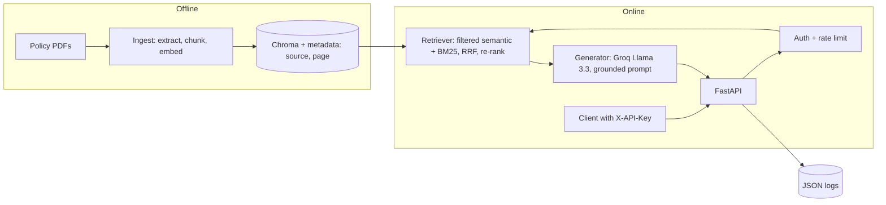

# Design: Policy RAG Assistant

## High-level design

## Low-level design

| Module | Responsibility |
|---|---|
| `ingest.py` | PDF text extraction, 800-char chunks with 100 overlap, local embeddings, Chroma insert |
| `retriever.py` | `semantic`, `keyword`, `hybrid` (Reciprocal Rank Fusion), `rerank` (cross-encoder); every method takes `allowed` (set of source files) |
| `generator.py` | Numbered context, grounded system prompt, returns only cited sources, `NO_ANSWER` fallback |
| `security.py` | `UserStore` (SHA-256 key hashes, constant-time compare), `RateLimiter` (sliding window) |
| `api.py` | `create_app()` factory with injected retriever/users/answer function (testable); middleware for request IDs and access logs |
| `observability.py` | JSON log formatter |

## Key decisions and trade-offs

- **Hybrid + re-rank:** BM25 catches exact policy terms (clause numbers, "waiting period") that embeddings blur; the cross-encoder fixes ordering. Cost: extra CPU latency.
- **Filter before ranking:** access control is applied inside retrieval (Chroma `where` and a BM25 mask), so forbidden text never reaches the prompt.
- **Index built at image build:** simple and reproducible, but updating documents means rebuilding the image.
- **No raw questions in logs:** only length and counts, to avoid storing customer text.

## Known limitations / next steps

- Rate limiter is per-process; multiple replicas need Redis.
- Chroma is embedded; a managed vector DB is needed for many documents or concurrent writers.
- No OCR for scanned PDFs; no incremental re-ingestion.
- API keys are static; production would add rotation and expiry (or OAuth/JWT).
- Eval set is LLM-generated and only spot-checked.