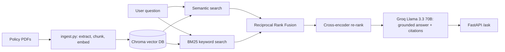

# Policy RAG Assistant

Ask questions about insurance policy documents and get **source-cited answers**.
Retrieval is hybrid (semantic + BM25) with a cross-encoder re-ranker, and the
LLM is instructed to answer only from the retrieved passages or say
"No answer found."

Built with free tools only: local embeddings, local vector DB, and Groq's free API.

## Architecture



## Stack

| Part | Choice |
|---|---|
| Embeddings | `BAAI/bge-small-en-v1.5` (local) |
| Vector DB | Chroma (local, persistent) |
| Keyword search | `rank-bm25` |
| Re-ranker | `cross-encoder/ms-marco-MiniLM-L-6-v2` |
| LLM | Llama 3.3 70B via Groq free tier |
| API | FastAPI |

## Setup

```bash
git clone https://github.com/EjazBhai/Insurance-Policy-RAG-Assistant.git
cd Insurance-Policy-RAG-Assistant
python -m venv .venv
.venv\Scripts\activate          # Windows  (Mac/Linux: source .venv/bin/activate)
pip install -r requirements.txt
```

1. Create `.env` with `GROQ_API_KEY=your_key` (free key at console.groq.com).
2. Put policy PDFs in `data/raw/` (see sources below).
3. Build the index and start the API:

```bash
python -m src.ingest
uvicorn src.api:app --reload
```

Open http://127.0.0.1:8000/docs and try `POST /ask`.

## Example

Request:
```json
{ "question": "Is dental treatment covered?" }
```
Response (shortened):
```json
{
  "answer": "Dental treatment is not covered under the policy unless it requires hospitalisation. [1]",
  "sources": [{ "file": "Health Protector Policy Wording.pdf", "page": 12, "snippet": "..." }],
  "latency_ms": 2300
}
```
Questions outside the documents return `"No answer found in the provided policy documents."`

## Evaluation

The retrieval benchmark uses a labelled dataset of 40 questions. A hit means
the expected source file and page appear in the top 5 results.

| Retrieval mode | Hit rate@5 | MRR |
|---|---:|---:|
| Semantic | 78% | 0.63 |
| Hybrid (semantic + BM25) | 82% | 0.67 |
| Hybrid + reranking | 93% | 0.79 |

Hybrid retrieval with cross-encoder reranking performed best on this dataset.
These results are specific to the current labelled questions and are not a
guarantee of performance on unseen policies.

Run the evaluations from the project root:

```bash
python -m eval.hit_rate
python -m eval.judge
```

The retrieval report is written to `eval/results_retrieval.md`.
The generation report is written to `eval/results_generation.md`.

The optional Streamlit Evaluation Lab is in `eval/hf_space/`. See
[`eval/HUGGING_FACE_DEPLOYMENT.md`](eval/HUGGING_FACE_DEPLOYMENT.md) for deployment instructions.

## Limitations

- Eval questions are generated from the same chunks they test, so they share
  wording with the source text. This likely makes hit rates optimistic.
- Groundedness is scored by an LLM judge, not human review and not RAGAS.
- Several insurers use near-identical wording, so a "miss" can still be a correct answer from another document.
- Scanned (image-only) PDFs are not supported (no OCR).
- Free-tier API rate limits apply.

## Source documents

Public policy wordings, downloaded from insurers' websites (not redistributed in this repo):

- Universal Sompo, A Plus Health: https://www.universalsompo.com/assets/file/a-plus-health-insurance/a-plus-health-insurance-policy-wording.pdf
- IFFCO Tokio, Health Protector: https://www.iffcotokio.co.in/content/dam/iffcotokio/iffco-pdf/sites/default/files/pdf/Health%20Protector%20Policy%20Wording.pdf
- United India, Individual Health Insurance prospectus: https://uiic.co.in/web/sites/default/files/Policy-Document/20240325_Prospectus_IHIP.pdf
- Religare, Health Care Advantage: https://www.eindiainsurance.com/brochure/religare-health-care-advantage-policy-wordings.pdf

## Docker (optional)

```bash
docker build -t policy-rag .
docker run -p 8000:8000 --env-file .env -v ${PWD}/chroma_db:/app/chroma_db policy-rag
```

## License

MIT, see [LICENSE](LICENSE).
