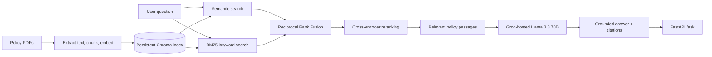

# 🛡️ Insurance Policy RAG Assistant

**Ask questions about insurance policy documents and receive evidence-backed answers with source citations.**

A retrieval-augmented generation (RAG) project built to make long policy wordings easier to search and understand. It combines semantic retrieval, BM25 keyword search, reciprocal-rank fusion, and cross-encoder reranking. Answers are grounded in retrieved policy passages; when evidence is insufficient, the system is instructed to say so.

<p align="center">
  <strong>Hybrid Retrieval</strong> · <strong>Reranking</strong> · <strong>Source Citations</strong> · <strong>Evaluation Dashboard</strong>
</p>

## ✨ Highlights

- **Evidence-first answers** — responses include the source document, page, and supporting snippet.
- **Hybrid search** — combines vector similarity with BM25 keyword matching.
- **Cross-encoder reranking** — reorders candidates to improve the relevance of the final context.
- **Grounded generation** — prompts the LLM to use retrieved evidence and abstain when the documents do not answer the question.
- **Evaluation suite** — labelled retrieval benchmark plus an LLM-as-judge generation evaluation.
- **API-first design** — FastAPI endpoint with interactive API documentation.
- **Local retrieval components** — embeddings and the Chroma vector store run locally; answer generation uses Groq's API.

## 📊 Evaluation Results

### Retrieval benchmark

Tested on **40 labelled questions**. A hit means the expected source file and page appeared among the top five retrieved results.

| Retrieval strategy | Hit rate@5 | MRR |
|---|---:|---:|
| Semantic search | 78% | 0.63 |
| Hybrid (semantic + BM25) | 82% | 0.67 |
| **Hybrid + cross-encoder reranking** | **93%** | **0.79** |

### Generation evaluation

| Metric | Result |
|---|---:|
| Questions evaluated | 30 |
| Answered rate | 100% |
| LLM-judged groundedness | 97% |
| Median latency | 9.05 s |
| p95 latency | 11.82 s |

**How to interpret these numbers:** results are from the current evaluation dataset. Groundedness is an LLM-judge estimate, not a human-verified accuracy score. The questions were created from the same policy chunks used for retrieval, which may make retrieval results optimistic. These metrics do not guarantee performance on unseen policies.

## 🏗️ Architecture



## 🧰 Technology Stack

| Component | Technology |
|---|---|
| API | FastAPI, Uvicorn |
| Embeddings | `BAAI/bge-small-en-v1.5` |
| Vector store | ChromaDB (persistent) |
| Keyword retrieval | `rank-bm25` |
| Reranker | `cross-encoder/ms-marco-MiniLM-L-6-v2` |
| Answer generation | Llama 3.3 70B via Groq API |
| Evaluation UI | Streamlit |
| Language | Python |

## 🚀 Run Locally

### 1. Clone and install

```powershell
git clone https://github.com/EjazBhai/Insurance-Policy-RAG-Assistant.git
cd Insurance-Policy-RAG-Assistant
python -m venv .venv
.venv\Scripts\Activate.ps1
pip install -r requirements.txt
```

### 2. Configure the API key

Create a `.env` file in the project root:

```env
GROQ_API_KEY=your_groq_api_key
```

Get a key from [Groq Console](https://console.groq.com/). **Never commit your real `.env` file or expose API keys in screenshots or logs.**

### 3. Add policy documents and build the index

Place policy PDFs in `data/raw/`, then run:

```powershell
python -m src.ingest
```

### 4. Start the API

```powershell
uvicorn src.api:app --reload
```

Open **http://127.0.0.1:8000/docs** to explore the API and try `POST /ask`.

## 💬 Example Request

```json
{
  "question": "Is dental treatment covered?"
}
```

The response schema includes an answer, source evidence (document/page/snippet), and latency. Exact coverage depends on the policy documents you have indexed. If the indexed evidence does not support an answer, the system is instructed to return an abstention rather than invent coverage.

## 🧪 Run the Evaluations

From the project root:

```powershell
python -m eval.hit_rate
python -m eval.judge
```

Reports are written to:

- `eval/results_retrieval.md`
- `eval/results_generation.md`

The evaluation dashboard code and deployment notes are in `eval/hf_space/` and `eval/HUGGING_FACE_DEPLOYMENT.md`. The dashboard displays saved evaluation reports; it is separate from the user-facing policy Q&A application.

## 📁 Project Structure

```text
├── src/
│   ├── api.py              # FastAPI endpoints
│   ├── ingest.py           # PDF ingestion and indexing
│   └── ...                 # Retrieval and application modules
├── data/
│   ├── raw/                # Add policy PDFs here (not bundled)
│   └── eval/               # Labelled evaluation questions
├── eval/
│   ├── hit_rate.py         # Retrieval benchmark
│   ├── judge.py            # Generation evaluation
│   ├── results_retrieval.md
│   ├── results_generation.md
│   └── hf_space/           # Streamlit evaluation dashboard
├── requirements.txt
└── README.md
```

## ⚠️ Limitations

- Evaluation coverage is small and results may be optimistic because questions were derived from the indexed chunks.
- Groundedness is judged by an LLM; independent human review is still needed.
- Similar wording across insurers can make source attribution difficult.
- Image-only scanned PDFs are not supported unless OCR is added.
- Groq rate limits and model availability may affect latency and throughput.
- This tool helps locate policy wording; it does not replace the full policy contract or professional advice.

## 📚 Sample Policy Sources

The project was evaluated using publicly available policy documents. They are **not redistributed in this repository**; retrieve them from the original publisher and check the current version before use.

- [Universal Sompo — A Plus Health policy wording](https://www.universalsompo.com/assets/file/a-plus-health-insurance/a-plus-health-insurance-policy-wording.pdf)
- [IFFCO Tokio — Health Protector policy wording](https://www.iffcotokio.co.in/content/dam/iffcotokio/iffco-pdf/sites/default/files/pdf/Health%20Protector%20Policy%20Wording.pdf)
- [United India Insurance — Individual Health Insurance prospectus](https://uiic.co.in/web/sites/default/files/Policy-Document/20240325_Prospectus_IHIP.pdf)
- [Religare — Health Care Advantage policy wording](https://www.eindiainsurance.com/brochure/religare-health-care-advantage-policy-wordings.pdf)

## 🐳 Docker (Optional)

If Docker is configured, use the Docker setup included in the repository. Keep API keys in an untracked `.env` file or a secret manager; never hard-code credentials into the image or commit them to Git.

## 📄 License

MIT — see [LICENSE](LICENSE).
